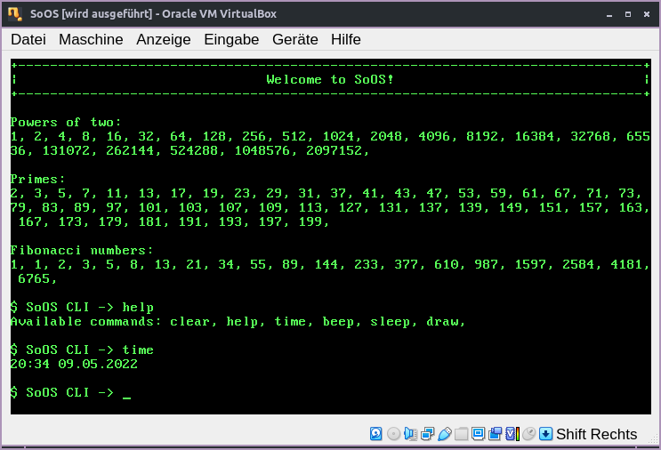
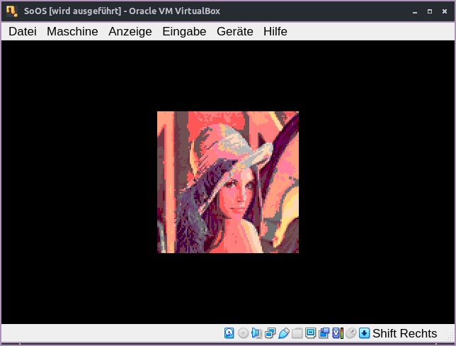

# SoOS - x86 operating system from scratch

  
  

  
## What it can do

- Full booting process from 16 bit real mode to 32 bit protected mode to kernel execution
- Interrupts & IRQs on C level
- Very simple command line interpreter
- Reading RTC time
- Beeping with the internal pc speaker
- VGA video mode

## Things I plan to add

- Generic drivers (video, audio, ATA)
- Implement more useful commandline programs
- Virtual 8086 mode for BIOS functions
- Add some lightweight C libraries

## There will likely never be

- Any non-generic drivers
- Fully-fledged filesystem support
- PCI[e] hardware support
- ACPI implementation
- Networking

## How it works

Black magic and a pact with the devil i guess

> Uses x86-i686 cross-compile toolchain from [bootlin.com](https://toolchains.bootlin.com/downloads/releases/toolchains/x86-i686/tarballs/x86-i686--glibc--stable-2021.11-1.tar.bz2)
